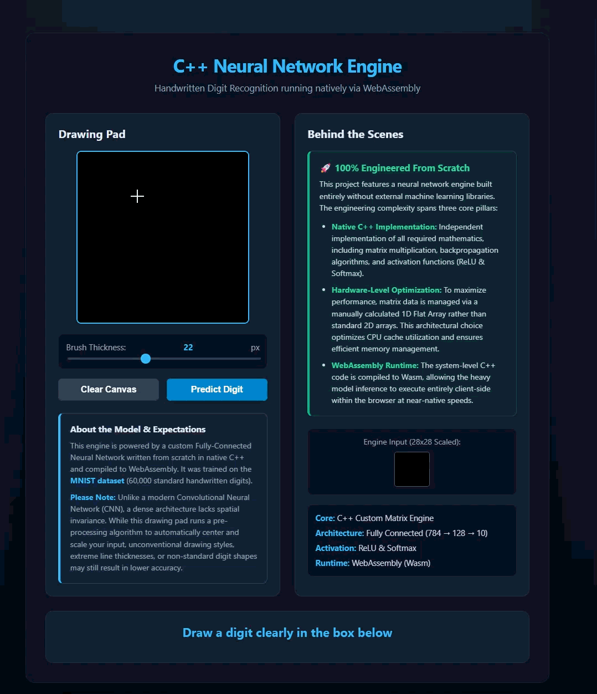

# Nexus Server 🚀

A lightweight, high-performance HTTP/1.1 web server built from scratch in **C++20** with zero external dependencies. The architecture leverages POSIX Sockets for networking, a fully integrated multi-threaded `WorkerThreadPool` for concurrent execution, and a hardened static file serving engine.

## Demo / Preview 🎬
Here is a live demonstration of the frontend (MNIST application) running smoothly on the custom C++20 server backend:



## Project Status: Production Ready ✅
* **Core Network Engine**: `HttpServer` utilizing POSIX Sockets, `SO_REUSEADDR` optimization, and cross-platform socket handling (`_WIN32`/POSIX).
* **Concurrency Engine**: Multi-threaded `WorkerThreadPool` protecting the task queue via `std::mutex`, `std::condition_variable`, and RAII locking with safe graceful shutdown.
* **Protocol & Parsing**: Robust HTTP/1.1 request parsing (`HttpRequestParser`) and clean response serialization (`HttpResponse`).
* **Routing & Static Delivery**: Declarative `Router` with automatic root-to-index mapping (`/` -> `/index.html`) and `StaticFileHandler` featuring absolute path isolation, strict MIME-type mapping, and optimized binary file reading (`std::ios::ate`).
* **Security**: Hardened **Path Traversal mitigation** using `std::filesystem::relative` to completely prevent directory traversal attacks (blocking `..` and absolute paths).
* **Load Testing & Performance**: Rigorously benchmarked and verified using **Grafana k6** under high concurrency stress.

## Theoretical Concepts & Architecture

### 1. Networking & POSIX Sockets
* **File Descriptors (fd)**: Treats network connections as standard I/O channels allowing standard read/write operations.
* **TCP Server Lifecycle**: Executes `socket()`, configures `setsockopt` with `SO_REUSEADDR` to bypass `TIME_WAIT` constraints, binds the port (`bind()`), queues connections (`listen()`), and accepts clients (`accept()`).

### 2. HTTP/1.1 Protocol Under the Hood
* **Formatting Rules**: Utilizes CRLF (`\r\n`) for line endings and a double CRLF (`\r\n\r\n`) to separate headers from the body payload.
* **Serialization/Deserialization**: Converts raw byte streams into logical C++ objects and serializes responses back to compliant text.
* **Content Management**: Relies on `Content-Type` for MIME mapping and `Content-Length` for precise payload sizing.

### 3. Concurrency & Multithreading
* **Thread Pool Model**: Pre-allocates a fixed number of workers to prevent resource exhaustion of a Thread-per-Client approach.
* **Synchronization**: Secures shared queues via `std::mutex` and `std::condition_variable` with RAII locking (`std::unique_lock`).
* **Graceful Shutdown**: Safely signals termination, wakes sleeping threads, and halts execution via `join()` to prevent leaks.

### 4. Security & Optimization
* **Path Traversal Mitigation**: Validates resolved paths against the base directory using `std::filesystem::relative` and checks for directory escape patterns (`..`), ensuring safe isolation within the `public/` directory.
* **Memory Optimization**: Efficient binary file reading using pre-allocated buffers (`std::ios::ate` with `file.read()`) to prevent memory fragmentation and handle large assets smoothly under heavy load.

## Performance Benchmarks (k6 Load Testing)
Tested under local stress conditions with up to 100 concurrent Virtual Users (VUs) over a 2-minute sustained load:
* **Total Requests Handled**: 62,737+ requests.
* **Success Rate**: **100.00%** (`0` failed checks / `0` dropped connections).
* **Throughput**: **~522.4 requests/sec** sustained.
* **Latency Profile**: Average `6.86ms`, Median `5.29ms`, p(95) `17.24ms`.

## How to Build & Run
```bash
# 1. Build project
mkdir -p build && cd build
cmake ..
cmake --build .

# 2. Run the Web Server
./nexus_server

# 3. Run Test Suites
./test_server_basic
./test_static_files